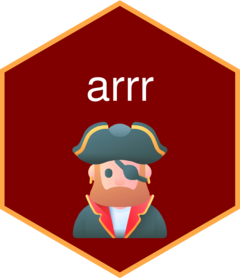

<!-- README.md is generated from README.Rmd. Please edit that file -->

```{r, include = FALSE}
knitr::opts_chunk$set(
  collapse = TRUE,
  comment = "#>",
  fig.path = "man/figures/README-",
  out.width = "100%"
)
```

# arrr  - WIP

<!-- badges: start -->
<!-- badges: end -->

The goal of arrr is to turn English into Pirate Speak.

## Installation

You can install the development version of arrr like so:

``` r
# install.packages("devtools")
devtools::install_github("parmsam/arrr")
```

## Example

This is a basic example which shows you how to solve a common problem:

```{r example}
# library(arrr)
## basic example code
```

## Credit

Hex icon created using the [hexmake
app](https://connect.thinkr.fr/hexmake/) from
[ColinFay](https://github.com/ColinFay/hexmake).

<a href="https://www.flaticon.com/free-icons/pirate" title="pirate icons">Pirate icons created by Freepik - Flaticon</a>
