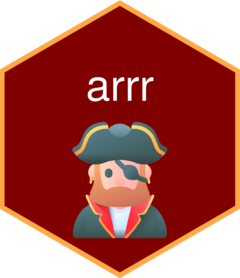

<!-- README.md is generated from README.Rmd. Please edit that file -->

# arrr  - WIP

<!-- badges: start -->
<!-- badges: end -->

The goal of arrr is to turn English into Pirate Speak.

## Installation

You can install the development version of arrr like so:

``` r
# install.packages("devtools")
devtools::install_github("parmsam/arrr")
```

## Example

This is a basic example which shows you how to solve a common problem:

``` r
library(arrr)
## basic example code

# Let's see what Pirate Gump would say?
translate("Mama always said life was like a box of chocolates. You never know what you\'re gonna get.")
#> [1] "Mama always said life be like a barrel o' chocolates. Ye nary know what you be gonna get. Savvy?"

# How about Pirate Michael?
translate(
  "Annie, are you ok? 
  So, Annie are you ok? 
  Are you ok, Annie?"
)
#> [1] "Annie, be ye ok? So, annie be ye ok? Be ye ok, annie?"

# Okay, last one. What about Pirate Drake? 
translate(
  "You used to call me on my
  You used to, you used to 
  Yeah 
  You used to call me on my cell phone"
)
#> [1] "Ye used t' call me on me ye used t', ye used t' aye ye used t' call me on me cell phone Weigh anchor and hoist the mizzen!"
```

## Credit

Hex icon created using the [hexmake
app](https://connect.thinkr.fr/hexmake/) from
[ColinFay](https://github.com/ColinFay/hexmake).

<a href="https://www.flaticon.com/free-icons/pirate" title="pirate icons">Pirate
icons created by Freepik - Flaticon</a>
